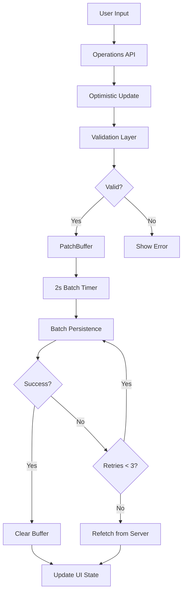

# Survey Editor Persistence System

## Overview

The survey editor persistence system is built on the **[Generalized Patchable State Pattern](../generalised-patchable-state.md)**, which provides a reusable solution for managing data with buffered edits and optimistic updates.

The system enables real-time collaborative editing with optimistic updates and batched API persistence. It provides a robust solution for managing survey modifications across multiple routes while preventing data loss and minimizing API calls.

The implementation uses the generic `usePatchableState` hook with survey-specific adapters (`useSurveyPatchableState`). An immutable PatchBuffer collects changes, validates them with mzen-schema, and persists them in 2-second batches. Changes made on any route (editor, settings, participants, etc.) are shared across the entire survey editing experience.

**Note:** For the general pattern and architecture, see [generalised-patchable-state.md](../generalised-patchable-state.md). This document focuses on survey-specific implementation details.

## Key Benefits

### Batched Persistence

- Collects multiple changes and sends them in a single API call
- 2-second batching interval balances responsiveness with API efficiency
- Reduces server load and network overhead
- Smart patch merging: multiple updates to the same entity are automatically merged

### Cross-Route State Sharing

- Edit survey from any page within the survey editing experience
- Navigate freely between routes without losing pending changes
- Same persistence instance shared via React Router's Outlet context
- Automatic save status synchronization across all pages

### Error Handling with Retry

- Automatic retry mechanism (up to 3 attempts)
- Auth token refresh before each request
- Graceful fallback: refetches from server after max retries
- Real-time save status feedback to users

### Data Loss Prevention

- Prevents refetch when changes are pending
- Applies buffered patches to refetched data during concurrent edits
- Navigation blocking when changes are being saved
- Optimistic updates with automatic rollback on failure

## Architecture

The system is built on several key components that work together:



**Flow:**

1. User makes a change (e.g., updates question text)
2. Operation function applies optimistic update to local state
3. Change is validated using mzen-schema (300ms debounce)
4. Valid change is added to PatchBuffer
5. Every 2 seconds, batched patches are sent to API
6. On success: buffer is cleared
7. On error: retry up to 3 times, then refetch from server

## Quick Start

### Accessing the Persistence System

The survey editor uses the **adapter pattern** from the generalized patchable state. The `useSurveyPatchableState` hook wraps the generic `usePatchableState` with survey-specific configuration.

Access is provided via the Zustand store in any component within the survey editor:

```typescript
import { useSurveyEditorStore } from '../hook/useSurveyEditorStore'

function MyComponent() {
  const operations = useSurveyEditorStore((s) => s.operations)
  const saveStatus = useSurveyEditorStore((s) => s.mutation.status)

  const handleUpdate = () => {
    // Optimistically updates UI and buffers change
    operations.updateQuestionText(questionId, "New text", "eng")
  }

  return (
    <div>
      <button onClick={handleUpdate}>Update</button>
      <div>Status: {saveStatus}</div>
    </div>
  )
}
```

**Note:** The operations API remains survey-specific, while the underlying persistence mechanism is now generic and reusable.

### Understanding Save Status

The mutation status reflects the current state of batch persistence:

- `idle` - No pending changes
- `pending` - Changes buffered, waiting for next batch cycle
- `loading` - Currently sending batch to server
- `error` - Last batch failed (will retry)
- `success` - Last batch succeeded

## Documentation Index

This documentation is organized into focused topics:

### [Architecture](./architecture.md)

Core concepts and design decisions behind the persistence system. Covers PatchBuffer design, batch persistence flow, immutability patterns, and why `useRef()` is critical.

### [Hooks Composition](./hooks-composition.md)

Complete guide to all hooks and how they compose together. Includes container setup, hook hierarchy, and data flow between hooks.

### [Operations](./operations.md)

The operation factory pattern and how to create new operations. Covers the standard operation pattern with examples and component integration.

### [Advanced Topics](./advanced-topics.md)

Deep dives into data loss prevention, cross-route persistence, error handling, retry mechanisms, and the validation system.

## Key Files Reference

**Generic Pattern (Reusable):**

- `/package/app/src/hook/usePatchableState.ts` - Generic patchable state hook
- `/package/common/src/model/service/PatchBuffer.ts` - Immutable patch buffer

**Survey-Specific Implementation:**

- `/package/app/src/appAdmin/component/SurveyEditor/hook/useSurveyPatchableState.ts` - Survey adapter for generic pattern; includes `langFetch`/`langDefault` in the React Query key to trigger language-driven refetches
- `/package/common/src/model/service/PatchApplierSurvey.ts` - Survey patch applier
- `/package/app/src/appAdmin/component/SurveyEditor/hook/useSurveyEditor.ts` - Top-level orchestrator
- `/package/app/src/appAdmin/component/SurveyEditor/hook/useSurveyEditorOperations.ts` - Operations API composition
- `/package/app/src/appAdmin/component/SurveyEditor/hook/useSurveyEditorStore.ts` - Zustand global state; holds `langEditing`, `langFetch`, `langDefault` language fields

**Language Loading:**

The survey editor loads only the active and default languages on demand. See [survey-language-loading.md](../../../../docs/survey-language-loading.md) for the API, store fields, and refetch behaviour.

**Container & Setup:**

- `/package/app/src/appAdmin/page/PageSurveyEdit/PageSurveyEditContainer.tsx` - Persistence initialization

**Operations:**
All located in `/package/app/src/appAdmin/component/SurveyEditor/operations/`

- `createSurveyOperations.ts` - Factory function
- `questionOperations.ts`, `surveyOperations.ts`, etc. - Entity-specific operations

## Design Philosophy

The persistence system follows these core principles:

1. **Reusability** - Built on the generalized patchable state pattern, allowing the same approach for any entity type
2. **Immutability** - All data structures are immutable, preventing mutation bugs
3. **Composability** - Hooks are small, focused, and compose cleanly via adapters
4. **Separation of Concerns** - Clear boundaries between generic logic and domain-specific adapters
5. **Optimistic Updates** - Users see changes immediately, then sync with server
6. **Fail-Safe** - Graceful degradation with automatic retry and refetch fallbacks
7. **Developer Experience** - Simple API surface for adding new operations

**Adapter Pattern Benefits:**

- Generic `usePatchableState` hook tested once, works everywhere
- Survey-specific logic isolated in adapters
- Easy to add new patchable entities (e.g., email templates, user preferences)
- Type-safe with full TypeScript generics support

---

For questions or improvements to this documentation, please refer to the source files or contact the development team.
