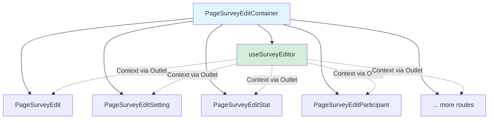
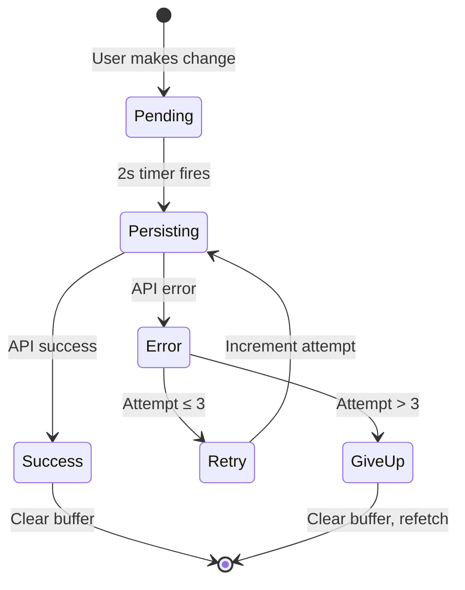
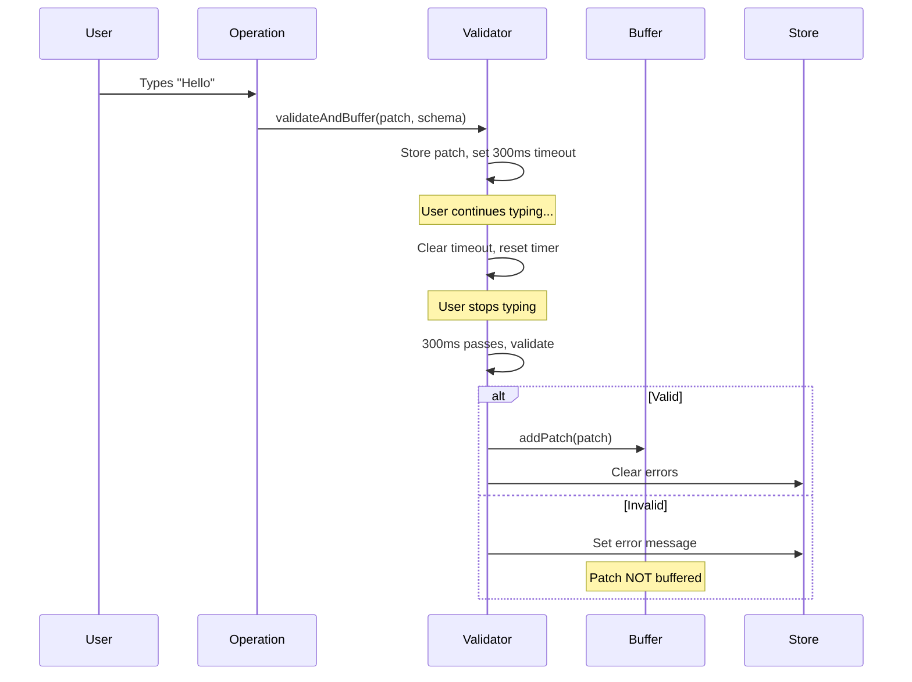

# Advanced Topics

This document covers advanced features of the survey editor persistence system. The implementation is built on the **[Generalized Patchable State Pattern](../generalised-patchable-state.md)**, which provides these features generically for all patchable entities.

## Data Loss Prevention

The most critical feature of the persistence system is preventing data loss during concurrent edits. This is handled by the generic `usePatchableState` hook and works automatically for all entities using the pattern. Without this, user changes could be overwritten by server refetches.

### Multi-Editor Sync

The survey editor does not poll. `useSurveyRealtimeSync` joins the survey's socket.io room and invalidates the `KEY_STATE_SURVEY_EDITING` query when `survey.changed` arrives from another client, and again after every reconnect. The saving client sends its `RealtimeClient.clientId` as `X-Client-Id`, so it skips its own event. The refetch goes through the same buffer-reapply path described below. See `package/api/docs/realtime.md`.

### The Problem

Consider this scenario:

1. User types "Hello" in a question field
2. Change is buffered (not yet persisted)
3. Server refetch happens (another editor changed something and the realtime `survey.changed` event triggered a refetch)
4. Fresh data arrives **without** "Hello"
5. User's change is lost ❌

This is a common bug in optimistic update systems. Our solution uses a two-pronged approach.

### Solution 1: Prevent Refetch When Buffer Has Data

The simplest solution: don't refetch while changes are pending. The generic `usePatchableState` hook implements this automatically.

```typescript
// In usePatchableState.ts (generic implementation)
useQuery({
  queryKey: config.queryKey,
  queryFn: config.fetchFn,
  enabled: config.enabled && patchBuffer.isEmpty(), // Only fetch when buffer empty
  refetchInterval: config.refetchInterval,
})
```

**How it works:**

- `enabled` condition checks if buffer is empty
- If buffer has pending patches: refetch is disabled
- Once buffer clears (after successful persistence): refetch is re-enabled

**Limitation:**
This prevents refetch completely while typing. If the user types for 5 minutes straight, we won't get any server updates during that time.

### Solution 2: Apply Buffered Patches to Refetched Data

The more sophisticated solution: allow refetch, but merge buffered changes with fresh data. The generic `usePatchableState` hook implements this using the `applyPatchesFn` configuration.

```typescript
// In usePatchableState.ts (generic implementation)
queryFn: async () => {
  // Fetch fresh data from server
  const freshData = await config.fetchFn()

  // Get current buffered patches
  const patches = patchBufferRef.current.getPatches()

  // Apply buffered patches to fresh data using configured applier
  return config.applyPatchesFn(patches, freshData)
}

// Survey adapter provides the survey-specific applier
useSurveyPatchableState({
  ...
  applyPatchesFn: (patches, survey) => PatchApplierSurvey.applyPatches(patches, survey)
})
```

**How it works:**

1. Fetch fresh data from server (has other users' changes)
2. Get current buffered patches (user's pending changes)
3. Apply patches to fresh data using PatchApplierSurvey
4. Return merged result

**Example Scenario:**

```
Initial state (server):
  Question 123: text = "What is your age?"

User types (buffered, not persisted):
  Question 123: text = "What is your current age?"

Another user changes (persisted on server):
  Question 123: required = true

Refetch happens:
  1. Fresh data: { text: "What is your age?", required: true }
  2. Buffered patch: { text: "What is your current age?" }
  3. Merged result: { text: "What is your current age?", required: true }

User sees: Their text change + other user's required flag change ✅
```

### PatchApplierSurvey

The `PatchApplierSurvey` class handles intelligent patch merging:

```typescript
export class PatchApplierSurvey {
  static applyPatches(patches: Patch[], survey: Survey): Survey {
    patches.forEach((patch) => {
      if (patch.action === 'create') {
        survey = this.applyCreate(patch, survey)
      } else if (patch.action === 'update') {
        survey = this.applyUpdate(patch, survey)
      } else if (patch.action === 'delete') {
        survey = this.applyDelete(patch, survey)
      }
    })

    return survey
  }

  private static applyUpdate(patch: Patch, survey: Survey): Survey {
    const entity = survey.getEntityByType(patch.type, patch.id)
    if (!entity) return survey // Entity doesn't exist, skip

    // Merge patch data into entity
    Object.keys(patch.data).forEach((key) => {
      ObjectPathAccessor.setPath(entity, key, patch.data[key])
    })

    return survey.replaceEntity(patch.type, entity)
  }

  // ... applyCreate and applyDelete implementations
}
```

**Key features:**

- Iterates through all buffered patches
- Applies CREATE, UPDATE, DELETE operations
- Uses `ObjectPathAccessor.setPath()` for nested updates
- Returns new Survey instance with merged state

**File:** `/package/common/src/model/service/PatchApplierSurvey.ts`

### Combined Approach

In practice, we use **both solutions**:

- Solution 1 prevents most unnecessary refetches
- Solution 2 handles edge cases where refetch happens anyway (manual trigger, cache invalidation, etc.)

This gives us maximum data protection with minimal server load.

## Cross-Route Persistence

One of the most powerful features: edit surveys from any route and have changes persist across navigation.

### Container-Level Initialization

The key is initializing persistence at the container level, not in individual pages.



**File:** `/package/app/src/appAdmin/page/PageSurveyEdit/PageSurveyEditContainer.tsx`

### Route Structure

```
/surveys/:surveyId (Container - persistence initialized here)
  ├─ /surveys/:surveyId (Main editor page)
  ├─ /surveys/:surveyId/settings (Settings page)
  ├─ /surveys/:surveyId/stats (Statistics page)
  ├─ /surveys/:surveyId/participants (Participants page)
  ├─ /surveys/:surveyId/emails (Email templates page)
  └─ ... more routes
```

All routes share the same container, therefore the same persistence instance.

### How It Works

**1. Container initializes persistence:**

```typescript
// PageSurveyEditContainer.tsx
export function PageSurveyEditContainer() {
  const { surveyId } = useParams()
  const editorContext = useSurveyEditor(surveyId)

  return (
    <div>
      <SurveyEditorNavigation />
      <Outlet context={editorContext} />
    </div>
  )
}
```

**2. Child routes receive context:**

```typescript
// PageSurveyEditSetting.tsx
export function PageSurveyEditSetting() {
  const { operations } = useOutletContext<SurveyEditorContext>()

  const handleUpdateName = (name: string) => {
    operations.updateSurveyName(name)
  }

  return <input onChange={(e) => handleUpdateName(e.target.value)} />
}
```

**3. User workflow:**

- User opens survey editor at `/surveys/123`
- Edits survey name on settings page → buffered
- Navigates to `/surveys/123/participants` → same container, navigation allowed
- 2 seconds later: batch persistence fires
- User sees save status update on current page (participants)
- All pages show the updated survey name

### Navigation Blocking

The system blocks navigation **away from** the survey editor while changes are pending:

```typescript
// In PageSurveyEditContainer.tsx
useUnifiedNavigationBlocker({
  condition: () => patchBuffer.hasPending(),
  message:
    'Your survey changes are still being saved. Are you sure you want to leave?',
})
```

**Behaviour:**

- Navigation **within** survey routes: allowed (e.g., editor → settings)
- Navigation **away** from survey routes: blocked if changes pending (e.g., editor → dashboard)
- User can override block by confirming the dialog

**Why this design:**

- Users can freely explore different survey pages while editing
- Prevents accidental loss when navigating to a completely different section
- Better UX than blocking all navigation

### Benefits

**Single Source of Truth:**

- One PatchBuffer for all routes
- Consistent save status everywhere
- No need to sync state between routes

**Flexible Editing:**

- Edit survey metadata on settings page
- Edit questions on main editor page
- Add participants on participants page
- All changes go to the same buffer and persist together

**Better Performance:**

- Single persistence instance
- One React Query cache
- No duplicate API calls

## Error Handling and Retry

The system implements robust error handling with automatic retry. This is handled by the generic `usePatchableState` hook with configurable retry attempts (default: 3).

### Retry Mechanism

**State Flow:**



### Implementation

```typescript
// In usePatchableState.ts (generic implementation)
useEffect(() => {
  if (mutation.isSuccess) {
    // Success path
    patchBufferRef.current = patchBufferRef.current.captureSuccess()
    queryClient.invalidateQueries(config.queryKey) // Refetch fresh data
  }

  if (mutation.isError) {
    // Error path
    patchBufferRef.current = patchBufferRef.current.captureError()

    const attempts = patchBufferRef.current.getApplyAttempt()

    if (attempts <= 3) {
      // Retry
      patchBufferRef.current = patchBufferRef.current.incrementApplyAttempt()
      const patches = patchBufferRef.current.getPatches()
      mutation.mutate(patches)
    } else {
      // Give up
      patchBufferRef.current = patchBufferRef.current.captureSuccess()
      queryClient.invalidateQueries(config.queryKey) // Triggers refetch
    }
  }
}, [mutation.status])
```

### Retry Behaviour

**Attempt 1:**

- Buffer state: pending → persisting
- Send patches to API
- API fails
- Buffer state: persisting → error
- Attempt counter: 1

**Attempt 2:**

- Buffer state: error → persisting
- Resend same patches
- API fails again
- Buffer state: persisting → error
- Attempt counter: 2

**Attempt 3:**

- Buffer state: error → persisting
- Resend same patches
- API fails again
- Buffer state: persisting → error
- Attempt counter: 3

**Give Up:**

- Buffer state: error → success (clears buffer)
- Invalidate React Query cache
- Triggers refetch from server
- User loses changes made during outage ⚠️

### Why 3 Attempts?

**Too few (1-2):**

- Doesn't handle transient network glitches
- Gives up too easily

**Too many (5+):**

- User sees "saving" state for too long
- If server is actually down, retrying is pointless
- Better to refetch and show user the real state

**3 is the sweet spot:**

- Handles most transient failures
- Fails fast enough to avoid confusing UX
- Matches common HTTP client retry patterns

### Auth Token Refresh

Auth token refresh is handled automatically by the `RestClient` pre-request interceptor — no explicit `authRefreshWithRetry()` call is needed in `persistPatchesFn`:

```typescript
// In useSurveyPatchableState.ts
usePatchableState({
  ...
  persistPatchesFn: async (patches) => {
    return getSurveyApi().patch(surveyId, patches)
  }
})
```

See the JWT refresh guidance in `package/app/AGENTS.md` (Hook Conventions section) for full details.

### UI Feedback

The `SurveySaveStatus` component shows real-time save status:

```typescript
// States
type SaveStatus = 'idle' | 'modified' | 'saving' | 'saved' | 'error' | 'loading'

// UI feedback
idle -> "Up to date"
modified -> "Modified"
saving -> "Saving..."
saved -> "Saved"
error -> "Save failed (retrying)"
loading -> "Loading..."
```

**File:** `/package/app/src/appAdmin/component/SurveyEditor/SurveySaveStatus.tsx`

## Validation System

The validation system ensures data integrity before persistence.

### Debounced Validation

Validation is debounced to prevent spam during typing:

```typescript
// In useValidateAndBuffer.ts
const DEBOUNCE_MS = 300

export function useValidateAndBuffer(patchBufferRef) {
  const timeoutMap = useRef<Map<string, NodeJS.Timeout>>(new Map())
  const pendingPatches = useRef<Map<string, PatchRequest>>(new Map())

  const validateAndBuffer = ({ patches, validation }) => {
    patches.forEach((patch) => {
      const key = `${patch.type}-${patch.id}-${validation?.path}`

      // Store patch
      pendingPatches.current.set(key, { patch, validation })

      // Clear existing timeout
      const existingTimeout = timeoutMap.current.get(key)
      if (existingTimeout) {
        clearTimeout(existingTimeout)
      }

      // Set new timeout
      const timeout = setTimeout(() => {
        runValidation(key)
        timeoutMap.current.delete(key)
      }, DEBOUNCE_MS)

      timeoutMap.current.set(key, timeout)
    })
  }

  return { validateAndBuffer }
}
```

### How Debouncing Works

**User types "Hello" (5 keystrokes):**

```
t=0ms:    Type 'H' → Set timeout for t=300ms
t=100ms:  Type 'e' → Clear previous timeout, set new for t=400ms
t=200ms:  Type 'l' → Clear previous timeout, set new for t=500ms
t=250ms:  Type 'l' → Clear previous timeout, set new for t=550ms
t=300ms:  Type 'o' → Clear previous timeout, set new for t=600ms
t=600ms:  Timeout fires → Validate "Hello"
```

**Result:**

- Only 1 validation for 5 keystrokes
- Validation happens 300ms after user stops typing
- Prevents validation spam and improves performance

### Validation Flow



### @datacapy/schema Validation

Each field has a @datacapy/schema Schema defining its validation rules:

```typescript
// Example: Question text validation
import { Schema } from 'veysur-common'

const questionTextSchema = new Schema({
  eng: { type: 'string', required: true, minLength: 1 },
  spa: { type: 'string', required: false },
  fre: { type: 'string', required: false },
})

// In operation
validateAndBuffer({
  patches: [{ type: 'question', id, data: { text } }],
  validation: {
    schema: questionTextSchema,
    path: `text.eng`,
    value: { eng: text },
    entityType: 'question',
    entityId: id,
    field: 'text',
  },
})
```

**On success:**

- `schema.validatePaths()` returns `{ isValid: true }`
- Error cleared from store
- Patch added to buffer
- Will be persisted in next batch

**On failure:**

- `schema.validatePaths()` returns `{ isValid: false, errors: {...} }`
- Error messages extracted and stored in Zustand
- Patch **NOT** buffered
- User sees error in UI
- Server never receives invalid data

### Field-Level Error Tracking

Errors are tracked by entity type, ID, and field:

```typescript
// Zustand store
interface SurveyEditorStore {
  validationErrors: Map<string, string[]> // Key format: "entityType:entityId:field"
  setValidationError: (
    entityType: string,
    entityId: string,
    field: string,
    errors: string[],
  ) => void
  clearValidationError: (
    entityType: string,
    entityId: string,
    field: string,
  ) => void
  getValidationError: (
    entityType: string,
    entityId: string,
    field: string,
  ) => string[] | undefined
}

// Example errors stored as:
// "question:123:text" -> ["Question text is required", "Text must be in English"]
// "survey:456:name" -> ["Survey name must be at least 3 characters"]
// "answerOption:789:label" -> []  // Cleared
```

**UI Components read errors:**

```typescript
function QuestionTextInput({ questionId }: Props) {
  const errors = useSurveyEditorStore((s) =>
    s.getValidationError('question', questionId, 'text')
  )

  return (
    <div>
      <input {...props} />
      {errors && errors.length > 0 && (
        <div className="error">{errors.join(', ')}</div>
      )}
    </div>
  )
}
```

### Fail-Open Design

The validation system is designed to fail open:

```typescript
try {
  const { isValid, errors } = await schema.validatePaths(validationData)

  if (isValid) {
    clearErrors()
    bufferPatch()
  } else {
    // Validation failed - expected behaviour
    setErrors(errors)
    // Do NOT buffer invalid patches
  }
} catch (err) {
  // Unexpected error - log but buffer anyway
  console.error('Validation failed unexpectedly', err)
  bufferPatch() // Buffer anyway to prevent data loss
}
```

**Why fail-open:**

- Validation edge cases shouldn't block user progress
- Better UX: let them save and fix issues later
- Server has final validation authority anyway
- Prevents data loss from validation bugs

### Why 300ms Debounce?

**Too short (< 100ms):**

- Still validates during typing
- Minimal performance benefit
- Distracting error messages appearing/disappearing

**Too long (> 500ms):**

- Feels laggy
- Users expect immediate feedback on errors
- Delays buffering of valid changes

**300ms is optimal:**

- Users pause briefly after typing a word/phrase
- Feels instant to humans
- Reduces validation calls by 90%+
- Industry standard (most form libraries use 250-500ms)

## Key Files Reference

**Generic Pattern (Reusable):**

- `/package/app/src/hook/usePatchableState.ts` - Generic patchable state hook (handles fetch, buffer, persistence, retry)
- `/package/common/src/model/service/PatchBuffer.ts` - Immutable patch buffer with retry tracking

**Survey-Specific Implementation:**

- `/package/app/src/appAdmin/component/SurveyEditor/hook/useSurveyPatchableState.ts` - Survey adapter for generic pattern
- `/package/common/src/model/service/PatchApplierSurvey.ts` - Survey-specific patch application logic

**Container:**

- `/package/app/src/appAdmin/page/PageSurveyEdit/PageSurveyEditContainer.tsx` - Container-level persistence

**Validation:**

- `/package/app/src/appAdmin/component/SurveyEditor/validation/useValidateAndBuffer.ts` - Debounced validation

**UI:**

- `/package/app/src/appAdmin/component/SurveyEditor/SurveySaveStatus.tsx` - Save status indicator

---

## Summary

The advanced features work together to create a robust persistence system:

1. **Data Loss Prevention**: Two-pronged approach prevents overwrites during concurrent edits
2. **Cross-Route Persistence**: Container-level initialization enables editing from any page
3. **Error Handling**: Automatic retry with smart fallback to refetch
4. **Validation**: Debounced, fail-open validation ensures data integrity without blocking users

These features combine to create a professional-grade editing experience that handles edge cases gracefully while maintaining simplicity for common scenarios.

---

Back to: [README](./README.md) - Return to documentation index
