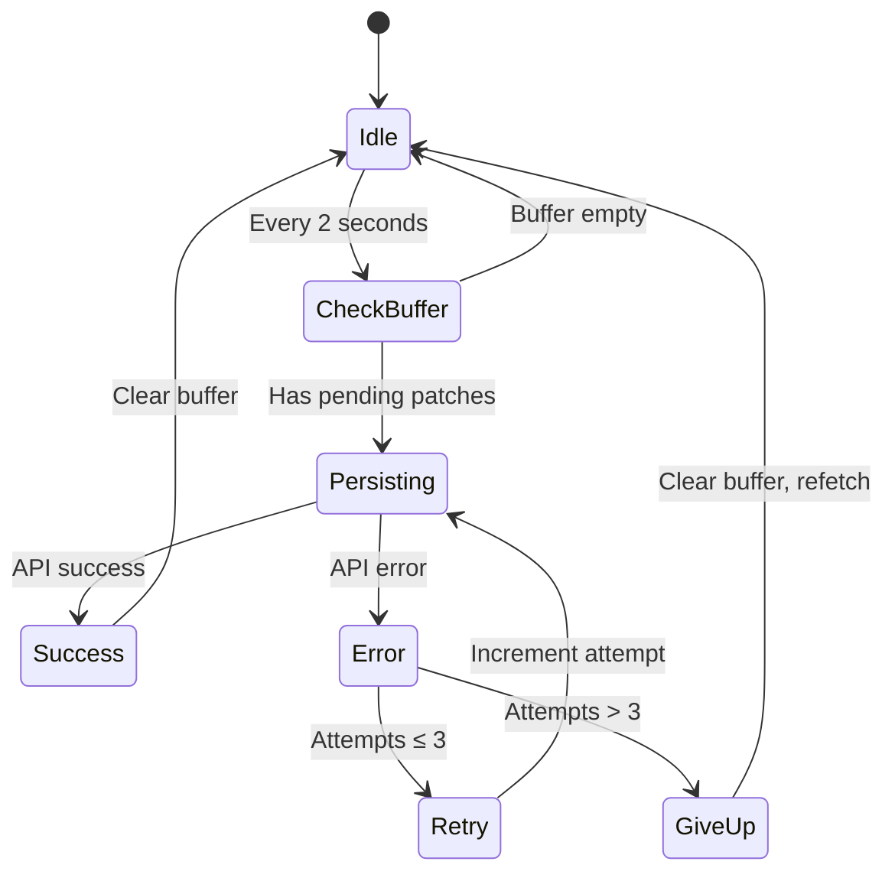

# Architecture

## Overview

The survey editor persistence is built on the **[Generalized Patchable State Pattern](../generalised-patchable-state.md)**. This document covers survey-specific implementation details. For the generic pattern architecture, see the main documentation.

## Core Concepts Overview

The persistence system solves several critical problems:

1. **API Efficiency** - Without batching, every keystroke would trigger an API call. Batching reduces hundreds of requests to just one per 2 seconds.

2. **Data Loss Prevention** - Concurrent edits from multiple sources (user typing + server refetch) could overwrite each other. The system merges changes intelligently.

3. **User Experience** - Optimistic updates provide instant feedback while background persistence happens transparently.

4. **State Consistency** - Cross-route editing requires shared state without prop drilling or complex context patterns.

5. **Reusability** - Generic pattern allows multiple entities (surveys, email templates) to share the same persistence mechanism.

### Design Philosophy

**Adapter Pattern**: The survey editor uses `useSurveyPatchableState`, a domain-specific adapter that wraps the generic `usePatchableState` hook with survey-specific configuration.

**Immutability**: All data structures (Survey, PatchBuffer) are immutable. Every change returns a new instance. This prevents accidental mutations and makes state changes explicit and traceable.

**Composability**: Each hook has a single responsibility. Hooks compose together to create the full system, making it easy to understand and extend.

**Separation of Concerns**: Clear boundaries between:

- Generic persistence logic (`usePatchableState`)
- Domain-specific adapters (`useSurveyPatchableState`)
- Validation (useValidateAndBuffer)
- Buffering (PatchBuffer - shared generic component)
- Patch application (PatchApplierSurvey - domain-specific)
- Operations (createSurveyOperations - domain-specific)

## PatchBuffer Design

PatchBuffer is a **shared generic component** used across all patchable entities. It's an immutable class that tracks patches through their lifecycle. The same PatchBuffer implementation serves surveys, email templates, and any other patchable entity.

### Immutable Structure

```typescript
// Each operation returns a new PatchBuffer instance
const buffer1 = new PatchBuffer()
const buffer2 = buffer1.addPatch(patch) // buffer2 is a new instance
const buffer3 = buffer2.capturePersisting() // buffer3 is a new instance
```

Every method returns a new instance, ensuring the previous state is never mutated.

### Four Patch States

Patches flow through a state machine:

1. **pending** - Just added, waiting to be sent
2. **persisting** - Currently being sent to server
3. **error** - Send failed, will retry
4. **success** - Successfully persisted (removed from buffer)

### Smart Patch Merging

When multiple patches target the same entity, they're automatically merged:

```typescript
// User updates question text twice before batch fires
buffer.addPatch({ type: 'question', id: '123', data: { text: 'Hello' } })
buffer.addPatch({ type: 'question', id: '123', data: { text: 'Hello World' } })

// Only one patch is sent with the latest value
buffer.getPatches() // [{ type: 'question', id: '123', data: { text: 'Hello World' } }]
```

This reduces payload size and prevents redundant updates.

### Why useRef() is Critical

This is one of the most important architectural decisions in the generic pattern. The `usePatchableState` hook uses `useRef()` internally to manage the PatchBuffer. Here's why `useRef()` is necessary:

**The Problem:**

- PatchBuffer is immutable (each operation returns a new instance)
- Multiple hooks need to share the same buffer reference
- We can't use React state because updates would trigger re-renders in all consuming hooks
- We can't recreate the buffer on every render because we'd lose pending patches

**The Solution:**

```typescript
// In usePatchableState (generic hook)
const patchBufferRef = useRef(new PatchBuffer())

// When buffer is updated
patchBufferRef.current = patchBufferRef.current.addPatch(patch)

// Survey adapter inherits this pattern
// useSurveyPatchableState → usePatchableState → uses patchBufferRef
```

**How it works:**

1. `useRef` creates a stable reference that persists across renders
2. The `.current` property points to the PatchBuffer instance
3. When buffer is updated, we assign the new instance to `.current`
4. Multiple hooks share the same `ref` object via props/context
5. Reading `ref.current` always gets the latest buffer
6. No re-renders are triggered because ref updates are not observed by React

**Why not useState?**

- `useState` would trigger re-renders in every component that reads the buffer
- This would cascade through all hooks and cause performance issues
- Buffer updates happen frequently (every user input), making this untenable

**Why not recreate on every render?**

- We'd lose all pending patches
- State would reset unexpectedly
- No persistence would occur

The `useRef` pattern gives us:

- Shared mutable container (the ref)
- Immutable buffer instances (the value inside)
- No unnecessary re-renders
- Stable reference across the component lifecycle

## Batch Persistence Flow

The generic `usePatchableState` hook implements a repeating debounced persistence mechanism (default 2 seconds) to process batched changes. The survey adapter inherits this behaviour.

### State Machine



### Detailed Flow

**Every 2 seconds:**

1. Check if buffer has pending patches
2. If empty: do nothing, wait for next cycle
3. If has patches: transition to persisting

**Persisting state:**

1. Mark patches as "persisting" in buffer
2. Call API mutation with patches array
3. Wait for response

**On Success:**

1. Mark patches as "success" (removes them from buffer)
2. Buffer is now empty
3. Return to idle state

**On Error:**

1. Mark patches as "error"
2. Check attempt count
3. If ≤ 3: increment attempt, retry immediately
4. If > 3: give up, clear buffer, invalidate cache (triggers refetch)

### Why 2-Second Batching?

The 2-second interval is a carefully chosen balance:

**Too short (< 1s):**

- Still too many API calls during rapid typing
- Increased server load
- More network overhead

**Too long (> 5s):**

- Users perceive lag between action and save
- Higher risk of data loss (more changes buffered)
- Delayed feedback on save errors

**2 seconds is optimal:**

- User finishes a thought/sentence before save
- Batch captures multiple related changes
- Quick enough for good UX
- Efficient enough to reduce API load by 10-100x

## Key Design Decisions

### Immutable Buffer

**Why:** Mutation bugs are notoriously hard to debug. Immutability makes state changes explicit and traceable. When debugging, you can inspect each buffer instance in its entirety without worrying about intermediate mutations.

**Trade-off:** Slightly more memory usage (new instances created), but modern JS engines optimize this well with structural sharing.

### Patch Merging

**Why:** When a user types "Hello World", that's 11 keystrokes. Without merging, we'd send 11 separate patches for the same field. Merging reduces this to one patch with the final value.

**Trade-off:** We lose the intermediate history, but the final state is all that matters for persistence.

### Container-Level Initialization

**Why:** Initializing persistence at the container level (PageSurveyEditContainer) instead of individual pages enables:

- Cross-route editing (edit from any page)
- Shared persistence state
- Navigation between routes without losing changes

**Trade-off:** Slightly more complex setup (container must use Outlet context), but huge UX benefit.

### Retry with Attempt Limit

**Why:** Network failures are common (poor connection, server restart, etc.). Automatic retry handles transient failures. The 3-attempt limit prevents infinite retry loops.

**Trade-off:** After 3 failures, we give up and refetch. User might lose changes if they edited during a prolonged outage. However, showing "save failed" for too long is worse UX than refetching.

## File References

**Generic Pattern (Reusable):**

- `/package/app/src/hook/usePatchableState.ts` - Generic patchable state hook with PatchBuffer management and batch persistence
- `/package/common/src/model/service/PatchBuffer.ts` - Shared PatchBuffer implementation
  - Methods: `addPatch`, `capturePersisting`, `captureError`, `captureSuccess`, `getPatches`, `isEmpty`, `hasPending`, `getApplyAttempt`, `incrementApplyAttempt`
  - Manages patch lifecycle and state transitions

**Survey-Specific Implementation:**

- `/package/app/src/appAdmin/component/SurveyEditor/hook/useSurveyPatchableState.ts` - Survey adapter for generic pattern
- `/package/common/src/model/service/PatchApplierSurvey.ts` - Survey-specific patch application logic
- `/package/app/src/appAdmin/component/SurveyEditor/hook/useSurveyEditor.ts` - Top-level orchestrator
- `/package/app/src/appAdmin/component/SurveyEditor/hook/useSurveyEditorOperations.ts` - Operations composition

---

Next: [Hooks Composition](./hooks-composition.md) - Learn how all hooks work together
