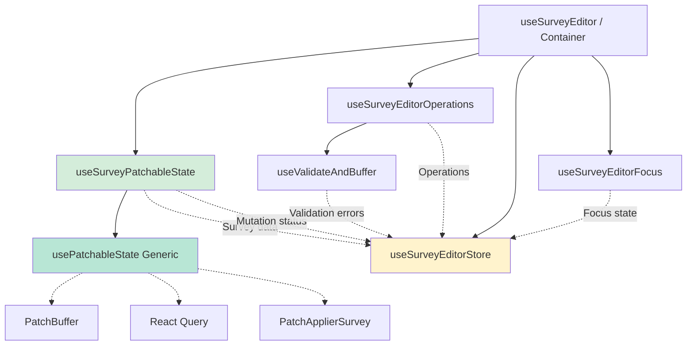

# Hooks Composition

## Overview

The survey editor now uses the **[Generalized Patchable State Pattern](../generalised-patchable-state.md)** for persistence. The generic `usePatchableState` hook handles data fetching, buffering, and persistence, while survey-specific hooks provide domain logic and operations.

This document describes how the hooks compose together. See the main pattern documentation for details on the generic implementation.

## Container Setup

### Why Container-Level Initialization?

The persistence hooks are initialized at `PageSurveyEditContainer`, not in individual pages. This architectural decision enables:

1. **Cross-Route Persistence** - Same buffer and operations available on all child routes
2. **Shared Context** - Survey data, operations, and save status consistent across pages
3. **Navigation Freedom** - Navigate between routes without interrupting persistence
4. **Single Source of Truth** - One persistence instance for the entire editing experience

### How Context Sharing Works

React Router's Outlet pattern propagates context to all child routes:

```typescript
// In PageSurveyEditContainer.tsx
const surveyEditorContext = useSurveyEditor(surveyId)

return (
  <div>
    <SurveyEditorNavigation />
    <Outlet context={surveyEditorContext} />  {/* Passes context to children */}
  </div>
)
```

All child pages (PageSurveyEdit, PageSurveyEditSetting, etc.) receive the same context, meaning the same operations and state.

### Navigation Blocking

The container implements navigation blocking to prevent data loss:

```typescript
useUnifiedNavigationBlocker({
  condition: () => patchBuffer.hasPending(),
  message:
    'Your survey changes are still being saved. Are you sure you want to leave?',
})
```

This blocks navigation **away from** the survey editor while changes are pending, but allows navigation **within** survey routes (settings → editor → participants).

**File:** `/package/app/src/appAdmin/page/PageSurveyEdit/PageSurveyEditContainer.tsx`

## Hook Hierarchy and Composition

The system combines the generic `usePatchableState` pattern for core persistence with survey-specific hooks for operations and UI state.



**Legend:**

- Green boxes: Generic patchable state components (reusable)
- Solid arrows: Hook dependencies
- Dashed arrows: Data flow to Zustand store

**Architecture:**

- `useSurveyPatchableState` (adapter) wraps the generic `usePatchableState` with survey-specific configuration
- Generic `usePatchableState` handles fetch, buffer, and persistence lifecycle
- Survey-specific hooks (operations, validation, focus) provide domain logic

## Hook Details

### useSurveyPatchableState

**Role:** Survey adapter for the generic patchable state pattern

**Responsibilities:**

- Wraps `usePatchableState` with survey-specific configuration
- Configures fetch function (getSurveyApi().getOne)
- Configures patch applier (PatchApplierSurvey)
- Configures persistence function (getSurveyApi().patch)
- Returns survey data, bufferPatches function, and mutation state

**Example:**

```typescript
export function useSurveyPatchableState({ surveyId }) {
  return usePatchableState<Survey, SurveyPatch>({
    queryKey: ['survey', surveyId],
    fetchFn: async () => {
      const data = await getSurveyApi().getOne(surveyId)
      return new Survey(data)
    },
    applyPatchesFn: (patches, survey) =>
      PatchApplierSurvey.applyPatches(patches, survey),
    persistPatchesFn: async (patches) =>
      await getSurveyApi().patch(surveyId, patches),
    debounceMs: 2000,
    enabled: !!surveyId,
  })
}
```

**Benefits:**

- Inherits all generic pattern features (retry, debounce, optimistic updates)
- Type-safe with Survey and SurveyPatch types
- No need to manage PatchBuffer or React Query directly
- Reuses tested generic implementation

**File:** `/package/app/src/appAdmin/component/SurveyEditor/hook/useSurveyPatchableState.ts`

---

### useSurveyEditor

**Role:** Top-level orchestrator

**Responsibilities:**

- Uses `useSurveyPatchableState` for core persistence via the adapter pattern
- Orchestrates data fetching and batch persistence
- Syncs survey data and loading states to Zustand store
- Composes with survey-specific hooks (operations, validation, focus)

**Why it's the orchestrator:**
It integrates the generic pattern with survey-specific logic, ensuring all hooks work together.

```typescript
export function useSurveyEditor(surveyId: string) {
  // Use generic pattern via adapter
  const {
    data: survey,
    bufferPatches,
    patchBuffer,
    patchMutation,
    ...rest
  } = useSurveyPatchableState({ surveyId })

  const operations = useSurveyEditorOperations({ surveyId, bufferPatches, ... })

  // Sync to store
  useSurveyEditorStore.setState({ survey, operations, ... })

  return { survey, operations, ... }
}
```

**File:** `/package/app/src/appAdmin/component/SurveyEditor/hook/useSurveyEditor.ts`

---

### useSurveyEditorOperations

**Role:** Operations API composition

**Responsibilities:**

- Composes `useSurveyEditorPatch` to get buffer and validation
- Creates mutator functions via `createSurveyOperations`
- Provides stable operation callbacks (uses `surveyRef` for latest data)
- Syncs operations, buffer, and mutation to Zustand store

**Key Pattern:**

```typescript
export function useSurveyEditorOperations(surveyId, patchBufferRef, ...) {
  const { validateAndBuffer } = useValidateAndBuffer(patchBufferRef)
  const surveyRef = useRef<Survey | null>(null)

  // Update ref when survey changes
  useEffect(() => {
    surveyRef.current = survey
  }, [survey])

  const operations = useMemo(() =>
    createSurveyOperations({
      updateSurveyState: (updater) => {
        const updated = updater(surveyRef.current!)
        setSurvey(updated)
        return updated
      },
      bufferPatches,
      setSurveyFocus,
      validateAndBuffer
    }),
    []  // Stable dependencies
  )

  return { operations, ... }
}
```

**Why surveyRef:**
Operations are created once (memoized) but need access to the latest survey data. The ref provides this without recreating operations.

**File:** `/package/app/src/appAdmin/component/SurveyEditor/hook/useSurveyEditorOperations.ts`

---

### useValidateAndBuffer

**Role:** Validation layer before buffering

**Responsibilities:**

- 300ms debounced validation (prevents spam during typing)
- mzen-schema validation
- Field-level error tracking
- Fail-open design (better UX)

**Debouncing Pattern:**

```typescript
// Each field has its own debounce timer
const timeoutMap = useRef<Map<string, NodeJS.Timeout>>(new Map())
const pendingPatches = useRef<Map<string, PatchRequest>>(new Map())

export function validateAndBuffer({ patches, validation }) {
  patches.forEach((patch) => {
    const key = `${patch.type}-${patch.id}-${validation.path}`

    // Store patch
    pendingPatches.current.set(key, { patch, validation })

    // Clear existing timeout
    if (timeoutMap.current.has(key)) {
      clearTimeout(timeoutMap.current.get(key))
    }

    // Set new timeout
    timeoutMap.current.set(
      key,
      setTimeout(() => {
        const pending = pendingPatches.current.get(key)

        try {
          // Validate
          validation.schema.parse(validation.value)

          // Clear errors
          setValidationErrors((errors) => ({ ...errors, [key]: null }))

          // Buffer patches
          patchBufferRef.current = patchBufferRef.current.addPatch(
            pending.patch,
          )
        } catch (err) {
          // Set errors, don't buffer
          setValidationErrors((errors) => ({ ...errors, [key]: err.message }))
        }

        pendingPatches.current.delete(key)
        timeoutMap.current.delete(key)
      }, 300),
    )
  })
}
```

**Why 300ms:**
Balances responsiveness with validation efficiency. Too short validates every keystroke. Too long feels laggy.

**File:** `/package/app/src/appAdmin/component/SurveyEditor/validation/useValidateAndBuffer.ts`

---

### useSurveyEditorStore

**Role:** Zustand global state management

**Responsibilities:**

- Stores survey data, operations, buffer, mutation status
- UI state: focus, language, validation errors, preferences
- Provides selectors for components

**Why Zustand:**

- Simple API for global state
- No provider wrapping needed
- Efficient re-renders (components subscribe to slices)

**Language state fields:**

The store holds three language fields that work together to drive on-demand language loading. The API returns L10n objects populated with only the active and default languages — not all languages — so the editor must re-fetch when the user switches to a language not currently loaded.

| Field         | Purpose                                                                                |
| ------------- | -------------------------------------------------------------------------------------- |
| `langDefault` | Survey's configured default language; initialised from `survey.language.default`       |
| `langFetch`   | The language last fetched from the server (determines what's in the React Query cache) |
| `langEditing` | The language the user is currently editing (drives all UI rendering)                   |

`useSurveyPatchableState` includes `[langFetch, langDefault]` in its React Query key. When the user selects a new language in `SurveyLanguageSelector`, `langFetch` is updated only if the language isn't already loaded (i.e. not `langDefault` and not the current `langFetch`). Changing `langFetch` changes the query key, triggering a fresh API call with `lang=<new>&defaultLang=<default>`.

See [survey-language-loading.md](../../../../docs/survey-language-loading.md) for the full picture including the API and participant flows.

**File:** `/package/app/src/appAdmin/component/SurveyEditor/hook/useSurveyEditorStore.ts`

---

### useSurveyEditorFocus

**Role:** Focus management for UI

**Responsibilities:**

- Tracks which survey entity is currently focused
- Used for highlighting and scrolling
- Syncs focus state to Zustand store

**File:** `/package/app/src/appAdmin/component/SurveyEditor/hook/useSurveyEditorFocus.ts`

---

## Clearing a translated field

The patch applier merges patch data into the existing entity, so an empty object
means "no change". When a user clears a translatable field (question text/detail,
subquestion text, group name, answer-option label) in a **secondary** language,
sending the emptied L10n object as-is would leave the stale translation in place.
The value must instead be sent with that language key set to an explicit `null`
so the applier removes it. Clearing the **default** language keeps `""` (a real
value the user set).

The L10n-model operations (`createSurveyOperations/*Operations.ts`) route this
single decision through `l10nFieldPatchValue` in
`createSurveyOperations/l10nFieldPatch.ts`; its JSDoc is the canonical
explanation.

---

## Data Flow Summary

**User Input → Operations → Validation → Buffer → Persistence → Store**

1. User types in a question text field
2. Component calls `operations.updateQuestionText(id, text, lang)`
3. Operation applies optimistic update to survey state
4. Operation calls `validateAndBuffer` with patch and validation config
5. After 300ms, validation runs
6. If valid: patch added to buffer
7. Every 2 seconds, `useSurveyEditorPatch` checks buffer
8. If buffer has patches: send to API
9. On success: clear buffer, refetch, update store
10. Store update triggers component re-render with new data

## Hook Dependencies

**Dependency Graph:**

```
useSurveyEditor (top)
  ├─ useSurveyPatchableState (adapter)
  │   └─ usePatchableState (generic)
  │       ├─ PatchBuffer (via useRef)
  │       ├─ React Query (fetch + mutation)
  │       └─ PatchApplierSurvey (apply patches)
  ├─ useSurveyEditorOperations
  │   └─ useValidateAndBuffer
  ├─ useSurveyEditorStore
  └─ useSurveyEditorFocus
```

**Shared References:**

- `patchBufferRef` - Created in `usePatchableState`, accessed via returned `patchBuffer`
- `surveyRef` - Created in `useSurveyEditorOperations`, provides latest survey data

---

Next: [Operations](./operations.md) - Learn how to create and use operations
